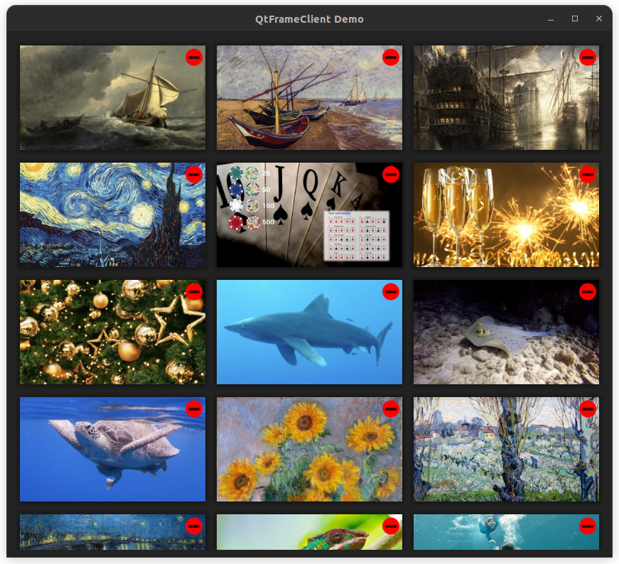

# Introduction to QFrameClient

## Description

The `QFrameClient` class allows developers to connect to and control Samsung The Frame TVs over a network connection. It provides methods to interact with the Frame TV's REST API, send Wake-On-LAN packets, control art mode, retrieve device information, and more.

## License

`QFrameClient` is open-source software distributed under the terms of the GNU General Public License (GPL) version 3 or later. See the [GNU General Public License](https://www.gnu.org/licenses/) for more details.

## Author

- Author: Arno Willig
- Email: akw@thinkwiki.org

## Getting Started

Developers can easily incorporate `QFrameClient` into their Qt projects and start building applications that bring a new level of interaction to Samsung The Frame TVs.

### Using QFrameClient in QML:

In your C++ code, possibly in your `main()` function, include the following:

```cpp
QFrameClient::registerQml();
```

At the top of your QML file, add:

```qml
import qframeclient 1.0
```

You can use the `FrameClient` component in QML like this:

```qml
FrameClient {
    id: frameClient
    clientName: "FrameClient"       // A name used by The Frame to identify clients
    macAddress: "54:3A:D6:XX:XX:XX" // Optional, only used for the Wake-On-LAN feature
    ipAddress: "192.168.178.108"    // The IP address of your Frame-Device.
    connected: true
}
```

This setup allows you to integrate `QFrameClient` into your Qt project and use it in your QML code.



## QFrameClient API Documentation

The `QFrameClient` class is part of the qframeclient library, allowing developers to communicate with Samsung The Frame TVs. This class provides methods and properties to interact with the Frame TV device over a network connection.

### Class Overview

- Class: QFrameClient
- Inherits: QObject

### Properties

- `macAddress` (QString): The MAC address of the Frame TV device.
- `ipAddress` (QString): The IP address of the Frame TV device.
- `clientName` (QString): A name used to identify the client.
- `connected` (bool): Indicates whether the client is connected to the Frame TV.
- `artModeStatus` (bool): Indicates whether the Frame TV is in art mode.
- `frameName` (QString): The name of the Frame TV device.
- `frameTVSupport` (bool): Indicates whether the Frame TV supports the client.

### Public Methods

- `QFrameClient(QObject *parent = nullptr)`: Constructor for the `QFrameClient` class.
- `virtual ~QFrameClient()`: Destructor for the `QFrameClient` class.
- `static void registerQml()`: Registers the `QFrameClient` class for use in QML.
- `bool isConnected() const`: Returns `true` if the client is connected to the Frame TV.
- `void setConnected(bool connected)`: Sets the connection status of the client.
- `QString macAddress() const`: Returns the MAC address of the Frame TV device.
- `void setMacAddress(const QString& macAddress)`: Sets the MAC address of the Frame TV device.
- `QString ipAddress() const`: Returns the IP address of the Frame TV device.
- `void setIpAddress(const QString& ipAddress)`: Sets the IP address of the Frame TV device.
- `QString clientName() const`: Returns the name used to identify the client.
- `void setClientName(const QString& clientName)`: Sets the name used to identify the client.
- `bool artModeStatus() const`: Returns `true` if the Frame TV is in art mode.
- `QVariantMap deviceInfo() const`: Returns a QVariantMap containing device information.
- `bool hasFrameTVSupport() const`: Returns `true` if the Frame TV supports the client.
- `QString frameName() const`: Returns the name of the Frame TV device.

### Public Slots

- `void connectToFrame()`: Initiates a connection to the Frame TV.
- `void disconnectFromFrame()`: Disconnects from the Frame TV.
- `void sendWakeOnLanPacket()`: Sends a Wake-On-LAN (WOL) packet to wake up the Frame TV.
- `void getApiVersion()`: Retrieves the API version from the Frame TV.
- `void getDeviceInfo()`: Retrieves device information from the Frame TV.
- `void getArtModeStatus()`: Retrieves the art mode status from the Frame TV.
- `void setArtModeStatus(bool artModeStatus)`: Sets the art mode status of the Frame TV.
- `void getContentList()`: Retrieves a list of content from the Frame TV.
- `void getCurrentArtwork()`: Retrieves the current artwork from the Frame TV.
- `void getMatteList()`: Retrieves a list of available mattes from the Frame TV.
- `void getPhotoFilterList()`: Retrieves a list of available photo filters from the Frame TV.
- `void selectImage(const QString& contentId, const QString& categoryId = QString())`: Selects an image on the Frame TV using the specified content ID and optional category ID.
- `void uploadImage(const QString& fileName, const QString& matte = "none")`: Uploads an image to the Frame TV with an optional matte.
- `void deleteImage(const QString& contentId)`: Deletes an image on the Frame TV using the specified content ID.
- `void getThumbnail(const QString& contentId)`: Retrieves a thumbnail image for the specified content ID.
- `void changeMatte(const QString& contentId, const QString& matteId)`: Changes the matte for a specific image on the Frame TV.

### Signals

- `macAddressChanged()`: Signal emitted when the MAC address property changes.
- `ipAddressChanged()`: Signal emitted when the IP address property changes.
- `clientNameChanged()`: Signal emitted when the client name property changes.
- `connectedChanged(bool connected)`: Signal emitted when the connection status changes.
- `gotDeviceInfo(const QVariantMap& deviceInfo)`: Signal emitted when device information is retrieved.
- `gotApiVersion(const QString& apiVersion)`: Signal emitted when the API version is retrieved.
- `artModeStatusChanged(bool artModeStatus)`: Signal emitted when the art mode status changes.
- `deviceInfoChanged()`: Signal emitted when device information changes.
- `favoriteChanged(const QString& contentId, bool status)`: Signal emitted when a favorite status for an image changes.
- `imageUploadFinished(const QString& contentId)`: Signal emitted when an image upload is finished.
- `gotContentList(const QVariantList& contentList)`: Signal emitted when a list of content is retrieved.
- `gotThumbnail(const QString& contentId, const QString& fileName)`: Signal emitted when a thumbnail image is retrieved.
- `imagesDeleted(const QStringList& contentIdList)`: Signal emitted when images are deleted.

This API documentation provides an overview of the `QFrameClient` class and its methods, properties, and signals, enabling developers to use this library for interacting with Samsung The Frame TVs in their Qt projects.
